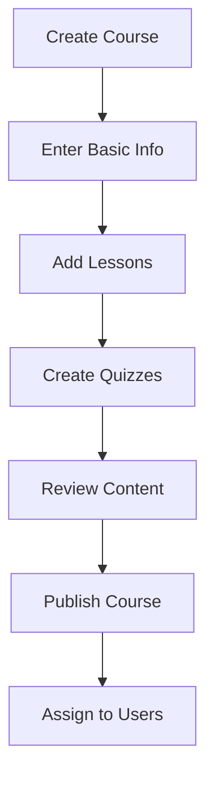
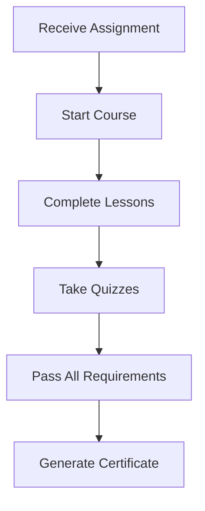
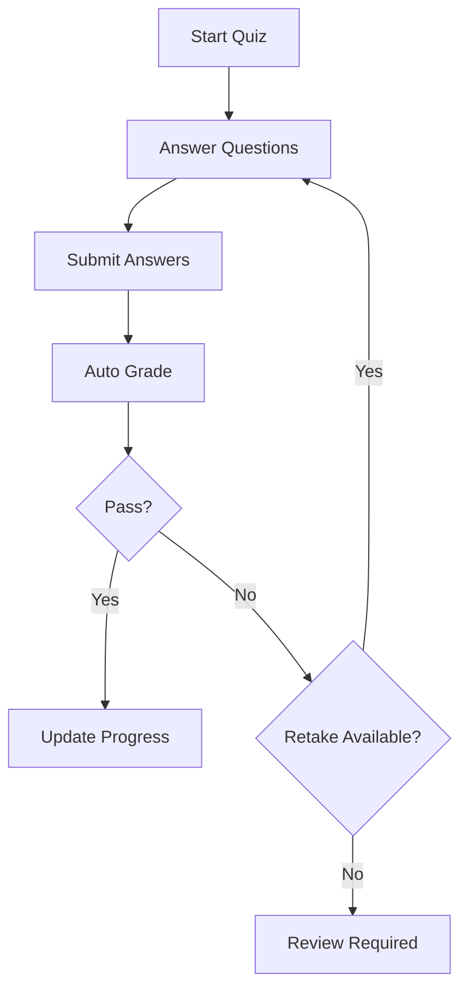

# Learning Management System (LMS) Documentation

## Table of Contents

1. [Overview](#overview)
2. [Architecture](#architecture)
3. [Core Features](#core-features)
4. [API Endpoints](#api-endpoints)
5. [Frontend Components](#frontend-components)
6. [Data Models](#data-models)
7. [User Workflows](#user-workflows)
8. [Integration Guide](#integration-guide)
9. [Deployment](#deployment)
10. [Testing](#testing)
11. [Troubleshooting](#troubleshooting)

## Overview

The MAS Business OS Learning Management System (LMS) is a comprehensive training platform designed to serve three distinct audiences:

- **Employees**: Internal training, skill development, and compliance courses
- **Candidates**: Pre-hire training and assessment for job applicants
- **Clients**: Product-specific training and user education

### Key Features

- Multi-format content support (video, PDF, articles, interactive)
- Advanced quiz system with multiple question types
- Progress tracking and analytics
- Certificate generation
- Mobile-responsive design
- Multi-language support
- Offline content capabilities
- Gamification elements

## Architecture

### System Overview

```
┌─────────────────┐    ┌─────────────────┐    ┌─────────────────┐
│   Client Apps   │    │   API Gateway   │    │   Database      │
│                 │    │                 │    │                 │
│ - Employee      │◄──►│ - Authentication│◄──►│ - Firestore     │
│ - Candidate     │    │ - Rate Limiting │    │ - Cloud Storage │
│ - Client Portal │    │ - Validation    │    │ - Cache (Redis) │
└─────────────────┘    └─────────────────┘    └─────────────────┘
         │                        │                        │
         └────────────────────────┼────────────────────────┘
                                  │
                      ┌─────────────────┐
                      │  LMS Services   │
                      │                 │
                      │ - CourseService │
                      │ - ProgressSrvc  │
                      │ - QuizService   │
                      │ - CertService   │
                      └─────────────────┘
```

### Technology Stack

**Backend:**
- Node.js with TypeScript
- Firebase Functions (serverless)
- Firestore (NoSQL database)
- Cloud Storage (file storage)

**Frontend:**
- React 18 with TypeScript
- Tailwind CSS
- React Router
- Custom hooks for state management

**Additional Services:**
- Authentication: Firebase Auth
- File Storage: Google Cloud Storage
- CDN: CloudFlare
- Monitoring: Firebase Analytics

## Core Features

### 1. Course Management

#### Course Types
- **Video Courses**: Streaming video content with progress tracking
- **Document Courses**: PDF and document-based learning
- **Article Courses**: Text-based content with rich formatting
- **Interactive Courses**: Embedded simulations and tools
- **Mixed Courses**: Combination of multiple content types

#### Course Structure
```
Course
├── Basic Information (title, description, audience, etc.)
├── Lessons (ordered content modules)
│   ├── Video Lessons
│   ├── Document Lessons
│   ├── Article Lessons
│   └── Interactive Lessons
├── Quizzes (assessments)
│   ├── Single Choice Questions
│   ├── Multiple Choice Questions
│   ├── True/False Questions
│   └── Text Answer Questions
└── Settings (prerequisites, passing score, certificates)
```

### 2. Assessment System

#### Question Types
- **Single Choice**: One correct answer from multiple options
- **Multiple Choice**: Multiple correct answers possible
- **True/False**: Binary choice questions
- **Text Answer**: Open-ended responses (manual grading)

#### Grading Features
- Automatic grading for objective questions
- Manual review for subjective questions
- Weighted scoring
- Passing score requirements
- Multiple attempt policies
- Time limits
- Question randomization

### 3. Progress Tracking

#### Individual Progress
- Lesson completion status
- Time spent per lesson
- Quiz scores and attempts
- Overall course completion percentage
- Learning velocity metrics

#### Administrative Reporting
- Course completion rates
- Average scores by course/user
- Time-to-completion analytics
- User engagement metrics
- Overdue assignment tracking

### 4. Certificate System

#### Certificate Types
- **Completion Certificates**: For finished courses
- **Achievement Certificates**: For high scores
- **Participation Certificates**: For engagement

#### Certificate Features
- PDF generation
- Digital signatures
- QR code verification
- Shareable URLs
- Template customization
- Batch generation

## API Endpoints

### Course Management

```
GET    /api/lms/courses                    # List all courses
GET    /api/lms/courses/:id                # Get course details
POST   /api/lms/courses                    # Create new course
PUT    /api/lms/courses/:id                # Update course
DELETE /api/lms/courses/:id                # Delete course
GET    /api/lms/courses/:id/stats          # Course statistics
```

### Lesson Management

```
GET    /api/lms/courses/:courseId/lessons  # Get course lessons
GET    /api/lms/lessons/:id                # Get lesson details
POST   /api/lms/lessons                    # Create lesson
PUT    /api/lms/lessons/:id                # Update lesson
DELETE /api/lms/lessons/:id                # Delete lesson
```

### Quiz Management

```
GET    /api/lms/courses/:courseId/quizzes  # Get course quizzes
GET    /api/lms/quizzes/:id                # Get quiz details
POST   /api/lms/quizzes                    # Create quiz
PUT    /api/lms/quizzes/:id                # Update quiz
DELETE /api/lms/quizzes/:id                # Delete quiz
POST   /api/lms/quizzes/:id/submit         # Submit quiz attempt
```

### Assignment Management

```
POST   /api/lms/assignments                # Create assignment
POST   /api/lms/assignments/bulk           # Bulk assign course
GET    /api/lms/users/:userId/assignments  # Get user assignments
GET    /api/lms/assignments/:id            # Get assignment details
PUT    /api/lms/assignments/:id            # Update assignment
DELETE /api/lms/assignments/:id            # Delete assignment
```

### Progress Tracking

```
PUT    /api/lms/assignments/:id/lessons/:lessonId/progress  # Update lesson progress
GET    /api/lms/progress/:type/:id                          # Get learner progress
GET    /api/lms/assignments/:id/progress                    # Get assignment progress
GET    /api/lms/courses/:id/progress/stats                  # Course progress stats
```

### Certificate Management

```
POST   /api/lms/assignments/:id/certificate    # Generate certificate
GET    /api/lms/assignments/:id/certificate     # Get certificate
GET    /api/lms/certificates/:type/:id          # Get learner certificates
POST   /api/lms/certificates/bulk              # Bulk generate certificates
GET    /api/lms/certificates/verify/:certId    # Verify certificate
```

## Frontend Components

### Component Hierarchy

```
LMS Module
├── Course Management
│   ├── CourseBuilder         # Course creation/editing
│   ├── CourseList           # Browse courses
│   ├── CourseDetails        # Course overview
│   └── CourseCard           # Course display card
├── Lesson Management
│   ├── LessonBuilder        # Create/edit lessons
│   ├── LessonViewer         # View lesson content
│   ├── VideoPlayer          # Video lesson player
│   ├── PDFViewer           # PDF document viewer
│   └── ArticleViewer       # Article content renderer
├── Assessment
│   ├── QuizBuilder          # Create/edit quizzes
│   ├── QuizTaker           # Take quizzes interface
│   └── QuestionEditor      # Individual question editing
├── Progress & Analytics
│   ├── ProgressTracker     # Track individual progress
│   ├── LearnerDashboard    # Student overview
│   ├── InstructorDashboard # Teacher analytics
│   └── Certificate         # Certificate display/download
└── Portal Integration
    ├── EmployeeTraining    # Employee portal interface
    ├── CandidateTraining   # Candidate portal interface
    └── ClientTraining      # Client portal interface
```

### Key Components

#### CourseBuilder
Multi-step course creation interface with:
- Basic course information
- Lesson management
- Quiz creation
- Review and publishing

#### LessonViewer
Unified lesson viewing component supporting:
- Video playback with progress tracking
- PDF document viewing
- Rich text article display
- Interactive content embedding

#### QuizTaker
Interactive quiz interface featuring:
- Timer functionality
- Question navigation
- Answer validation
- Progress indicators
- Result display

#### ProgressTracker
Comprehensive progress monitoring with:
- Visual progress bars
- Completion status
- Time tracking
- Performance metrics

## Data Models

### Core Entities

#### Course
```typescript
interface Course {
  id: string;
  title: string;
  description?: string;
  audience: 'employee' | 'candidate' | 'client' | 'mixed';
  duration?: number; // hours
  thumbnail?: string;
  active: boolean;
  productId?: string; // for client training
  certificateTemplateId?: string;
  passingScore?: number;
  tags?: string[];
  createdAt: Date;
  updatedAt: Date;
  createdBy: string;
}
```

#### Lesson
```typescript
interface Lesson {
  id: string;
  courseId: string;
  title: string;
  description?: string;
  type: 'video' | 'document' | 'article' | 'interactive';
  content?: string; // for articles
  url?: string; // for videos/documents
  duration?: number; // minutes
  order: number;
  required: boolean;
  createdAt: Date;
  updatedAt: Date;
}
```

#### Quiz
```typescript
interface Quiz {
  id: string;
  lessonId?: string;
  courseId?: string;
  title: string;
  description?: string;
  timeLimit?: number; // minutes
  attempts?: number;
  questions: Question[];
  randomizeQuestions: boolean;
  showResults: boolean;
  createdAt: Date;
  updatedAt: Date;
}
```

#### Assignment
```typescript
interface Assignment {
  id: string;
  courseId: string;
  userId?: string;
  candidateId?: string;
  accountId?: string;
  assignedBy: string;
  dueDate?: Date;
  status: 'not_started' | 'in_progress' | 'completed' | 'expired';
  startedAt?: Date;
  completedAt?: Date;
  progressPct: number;
  score?: number;
  certificate?: string;
  lastActivity?: Date;
  lessonProgress?: LessonProgress[];
  quizAttempts?: QuizAttempt[];
}
```

## User Workflows

### 1. Course Creation Workflow (Instructor)



### 2. Learning Workflow (Student)



### 3. Assessment Workflow



## Integration Guide

### Employee Portal Integration

```typescript
import { LearnerDashboard } from '@/modules/lms/components';

// In Employee Portal
<LearnerDashboard
  learnerId={employee.id}
  learnerType="user"
  learnerName={employee.name}
/>
```

### Candidate Portal Integration

```typescript
import { CandidateTraining } from '@/modules/lms/components';

// In Candidate Portal
<CandidateTraining
  candidateId={candidate.id}
  candidateName={candidate.name}
  stage={candidate.stage}
/>
```

### Client Portal Integration

```typescript
import { ClientTraining } from '@/modules/lms/components';

// In Client Portal
<ClientTraining
  accountId={client.id}
  clientName={client.name}
  products={client.products}
/>
```

### API Integration Example

```typescript
import { useCourses, useAssignments } from '@/modules/lms/hooks';

const MyLearningComponent = () => {
  const { courses, getCoursesByAudience } = useCourses();
  const { assignments, getUserAssignments } = useAssignments();

  useEffect(() => {
    // Load courses for employees
    getCoursesByAudience('employee');

    // Load user's assignments
    getUserAssignments(userId);
  }, []);

  return (
    <div>
      {/* Your component JSX */}
    </div>
  );
};
```

## Deployment

### Backend Deployment (Firebase Functions)

```bash
# Install dependencies
npm install

# Build the project
npm run build

# Deploy to Firebase
firebase deploy --only functions:lms
```

### Frontend Deployment

```bash
# Build frontend
npm run build

# Deploy to hosting service
npm run deploy
```

### Environment Configuration

```env
# Firebase configuration
FIREBASE_PROJECT_ID=your-project-id
FIREBASE_API_KEY=your-api-key

# Storage configuration
CLOUD_STORAGE_BUCKET=your-storage-bucket

# Authentication
JWT_SECRET=your-jwt-secret
```

### Database Indexes

Required Firestore indexes for optimal performance:

```javascript
// Courses collection
{
  fields: [
    { fieldPath: "audience", order: "ASCENDING" },
    { fieldPath: "active", order: "ASCENDING" },
    { fieldPath: "createdAt", order: "DESCENDING" }
  ]
}

// Assignments collection
{
  fields: [
    { fieldPath: "userId", order: "ASCENDING" },
    { fieldPath: "status", order: "ASCENDING" },
    { fieldPath: "dueDate", order: "ASCENDING" }
  ]
}

// Lessons collection
{
  fields: [
    { fieldPath: "courseId", order: "ASCENDING" },
    { fieldPath: "order", order: "ASCENDING" }
  ]
}
```

## Testing

### Unit Testing

```typescript
// Test example for ProgressCalculator
import { ProgressCalculator } from '@/modules/lms/utils';

describe('ProgressCalculator', () => {
  test('calculates course progress correctly', () => {
    const lessons = [
      { id: '1', required: true, duration: 30 },
      { id: '2', required: true, duration: 45 },
      { id: '3', required: false, duration: 20 }
    ];

    const lessonProgress = [
      { lessonId: '1', completed: true },
      { lessonId: '2', completed: false }
    ];

    const progress = ProgressCalculator.calculateCourseProgress(
      lessons,
      lessonProgress,
      true // required only
    );

    expect(progress).toBe(50); // 1 of 2 required lessons completed
  });
});
```

### Integration Testing

```typescript
// Test API endpoints
describe('LMS API', () => {
  test('creates course successfully', async () => {
    const courseData = {
      title: 'Test Course',
      audience: 'employee',
      description: 'A test course'
    };

    const response = await request(app)
      .post('/api/lms/courses')
      .send(courseData)
      .expect(201);

    expect(response.body.success).toBe(true);
    expect(response.body.data.title).toBe(courseData.title);
  });
});
```

### Performance Testing

Monitor key metrics:
- API response times < 200ms
- Course loading < 2 seconds
- Quiz submission < 500ms
- Certificate generation < 5 seconds

## Troubleshooting

### Common Issues

#### 1. Quiz Not Submitting
**Symptoms**: Quiz submission fails or hangs
**Solutions**:
- Check network connectivity
- Verify quiz has questions
- Ensure user has permission
- Check time limits

#### 2. Video Not Playing
**Symptoms**: Video lessons don't load or play
**Solutions**:
- Verify video URL is accessible
- Check browser video codec support
- Ensure sufficient bandwidth
- Try different video format

#### 3. Progress Not Updating
**Symptoms**: Lesson completion not tracked
**Solutions**:
- Verify assignment ID is correct
- Check user authentication
- Ensure API endpoints are accessible
- Review browser console for errors

#### 4. Certificate Generation Fails
**Symptoms**: Certificate not generated after completion
**Solutions**:
- Verify course completion requirements
- Check passing score criteria
- Ensure certificate template exists
- Review server logs for errors

### Error Codes

| Code | Description | Solution |
|------|-------------|----------|
| LMS001 | Course not found | Verify course ID exists |
| LMS002 | Assignment not found | Check assignment ID |
| LMS003 | Insufficient permissions | Review user role/permissions |
| LMS004 | Quiz attempt limit exceeded | Check attempt limits |
| LMS005 | Certificate requirements not met | Complete all requirements |

### Performance Optimization

1. **Database Optimization**
   - Use composite indexes for complex queries
   - Implement data pagination
   - Cache frequently accessed data

2. **Frontend Optimization**
   - Lazy load course content
   - Implement virtual scrolling for lists
   - Use React.memo for expensive components

3. **Media Optimization**
   - Use CDN for video content
   - Implement adaptive video streaming
   - Compress images and documents

### Monitoring and Logging

Use Firebase Analytics and custom logging:

```typescript
// Log important events
analytics.logEvent('course_started', {
  courseId: course.id,
  userId: user.id,
  timestamp: new Date().toISOString()
});

analytics.logEvent('quiz_completed', {
  quizId: quiz.id,
  score: result.percentage,
  attempts: attemptCount
});
```

## Support

For technical support or questions:
- Create issues in the project repository
- Contact the development team
- Review the troubleshooting section
- Check system status page

---

**Version**: 1.0.0
**Last Updated**: 2024-01-24
**Authors**: MAS Development Team