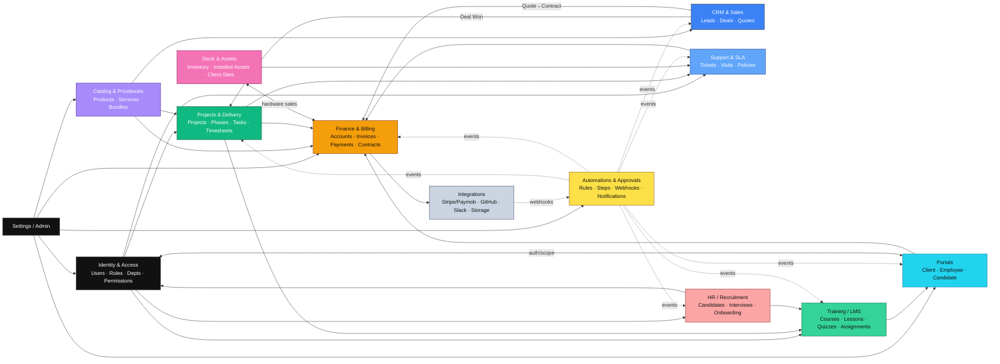
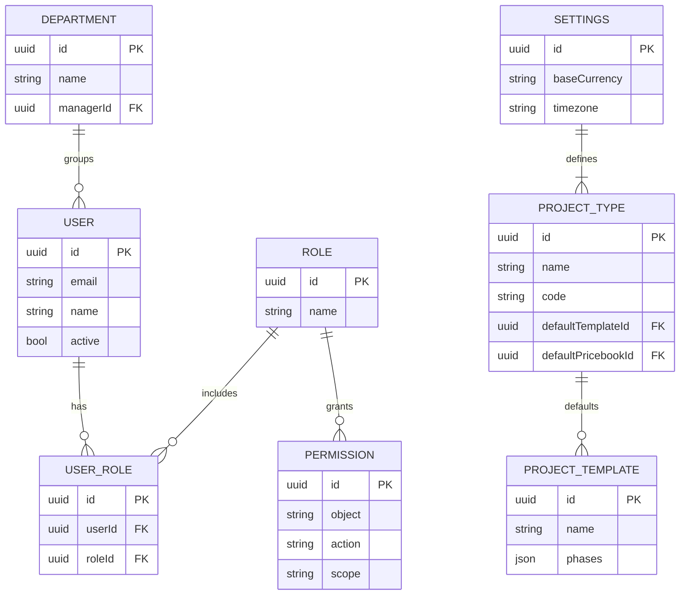
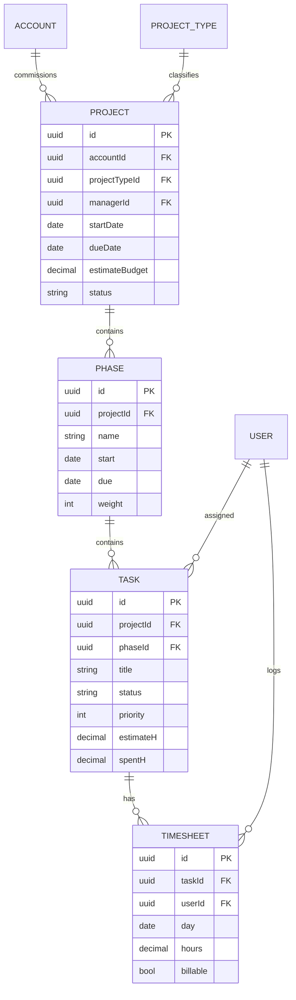
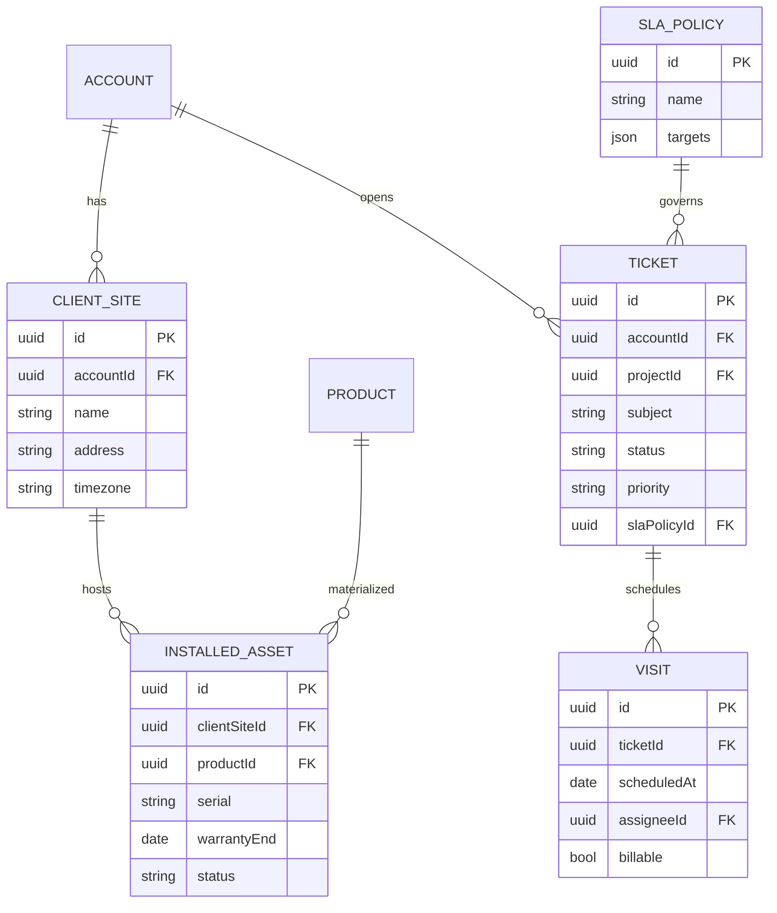
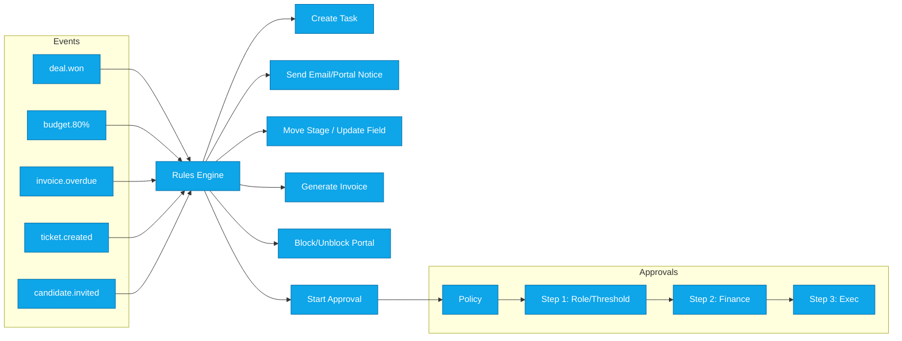
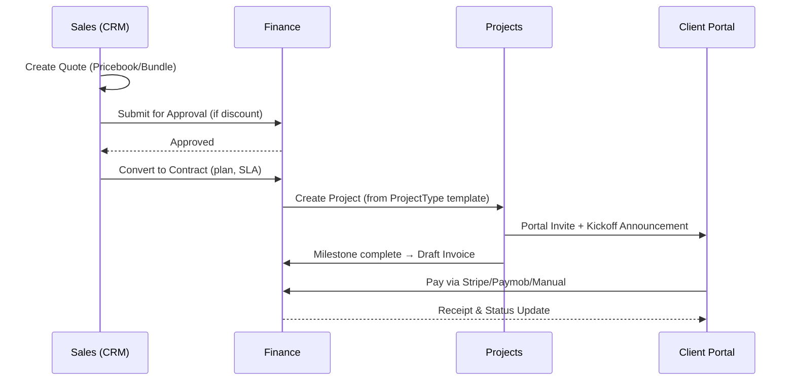
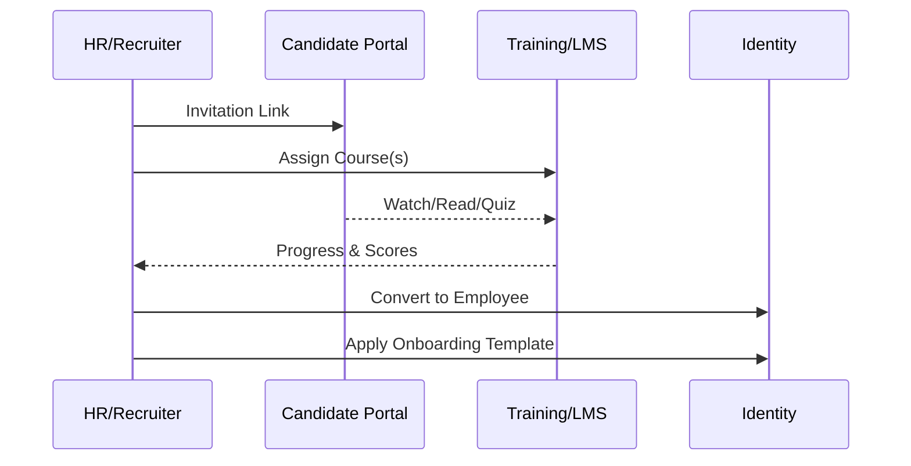

# MAS Business OS — ERD & Architecture (vFinal)

> Ultra-think blueprint: high-level module map + domain-sliced ERDs. Each ERD focuses on a bounded context for clarity. Use these as source for codegen and DB migrations.
> Legend: `||` = 1, `o{` = many (optional), `|{` = many (required); dashed arrows = async/event.

---

## 1) High-Level Module Architecture (C4: Container/Module)



**Key flows**

* **Deal → Project → Billing:** CRM creates Projects; Quotes convert to Contracts; Finance issues invoices.
* **Service/Hardware → Stock/Assets:** Selling hardware creates Installed Assets at Client Sites.
* **Candidate → Hire → Onboard:** HR assigns pre-hire courses, then converts Candidate to Employee + onboarding checklist.
* **Training across audiences:** Same LMS engine assigns courses to **Employees**, **Candidates**, and **Clients** (per product).

---

## 2) Identity & Settings (RBAC, Depts, Project Types)



---

## 3) CRM & Catalog (Leads, Deals, Pricebooks, Bundles)

```mermaid
erDiagram
  ACCOUNT ||--o{ OPPORTUNITY : has
  ACCOUNT ||--o{ ACTIVITY : logs
  OPPORTUNITY ||--o{ QUOTE : proposes
  QUOTE ||--|{ QUOTE_LINE : contains
  PRICEBOOK ||--o{ PRICEBOOK_ENTRY : contains
  PRODUCT ||--o{ PRICEBOOK_ENTRY : priced_in
  SERVICE ||--o{ PRICEBOOK_ENTRY : priced_in
  BUNDLE ||--o{ BUNDLE_COMP : has
  PRODUCT ||--o{ BUNDLE_COMP : component
  SERVICE ||--o{ BUNDLE_COMP : component

  ACCOUNT {
    uuid id PK
    string name
    string tier
  }
  OPPORTUNITY {
    uuid id PK
    uuid accountId FK
    decimal amount
    date expectedClose
    string stage
  }
  QUOTE {
    uuid id PK
    uuid opportunityId FK
    uuid pricebookId FK
    string status
    currency currency
    decimal total
  }
  QUOTE_LINE {
    uuid id PK
    uuid quoteId FK
    uuid itemId
    string itemType  // product|service|bundle
    int qty
    decimal unitPrice
    decimal lineTotal
  }
  PRICEBOOK {
    uuid id PK
    string name
    currency currency
    date validFrom
    date validTo
    string region
  }
  PRICEBOOK_ENTRY {
    uuid id PK
    uuid pricebookId FK
    uuid itemId
    decimal unitPrice
    string taxClass
  }
  PRODUCT {
    uuid id PK
    string sku
    string name
    bool trackStock
  }
  SERVICE {
    uuid id PK
    string code
    string name
    bool fixedFee
    decimal defaultFee
  }
  BUNDLE {
    uuid id PK
    string name
    uuid pricebookId FK
    decimal bundlePrice
  }
  BUNDLE_COMP {
    uuid id PK
    uuid bundleId FK
    uuid itemId
    int qty
  }
```

---

## 4) Projects & Delivery (Projects, Phases, Tasks, Timesheets)



---

## 5) Finance & Billing (Contracts, Invoices, Accounts, Transactions)

```mermaid
erDiagram
  ACCOUNT(=Client) ||--o{ CONTRACT : signs
  CONTRACT ||--o{ INVOICE : bills
  INVOICE ||--o{ PAYMENT : receives
  FIN_ACCOUNT ||--o{ TRANSACTION : posts
  PROJECT ||--o{ TRANSACTION : consumes_budget
  QUOTE ||--|| CONTRACT : converts

  CONTRACT {
    uuid id PK
    uuid accountId FK
    uuid productId FK
    date start
    date end
    bool autoRenew
    uuid slaPolicyId FK
    json entitlements
  }
  INVOICE {
    uuid id PK
    uuid contractId FK
    uuid projectId FK
    date issueDate
    date dueDate
    currency currency
    decimal total
    string status
  }
  PAYMENT {
    uuid id PK
    uuid invoiceId FK
    date paidAt
    decimal amount
    string method // stripe|paymob|instapay|bank
    string ref
  }
  FIN_ACCOUNT {
    uuid id PK
    string name
    string type // bank|cash|wallet|income|expense
    currency currency
  }
  TRANSACTION {
    uuid id PK
    uuid finAccountId FK
    uuid projectId FK
    date date
    string type // income|expense|transfer
    decimal amount
    string memo
  }
```

---

## 6) Support, Sites & Assets (Tickets, Visits, Installed Assets)



---

## 7) Training / LMS (Courses, Lessons, Quizzes, Assignments)

```mermaid
erDiagram
  COURSE ||--o{ LESSON : contains
  LESSON ||--o{ QUIZ : may_have
  QUIZ ||--o{ QUESTION : has
  COURSE ||--o{ ASSIGNMENT : targeted_by
  USER ||--o{ ASSIGNMENT : receives
  CANDIDATE ||--o{ ASSIGNMENT : receives
  PRODUCT ||--o{ COURSE : product_training

  COURSE {
    uuid id PK
    string title
    string audience // employee|candidate|client|mixed
  }
  LESSON {
    uuid id PK
    uuid courseId FK
    string title
    string type // video|pdf|article
    string url
  }
  QUIZ {
    uuid id PK
    uuid lessonId FK
    string title
  }
  QUESTION {
    uuid id PK
    uuid quizId FK
    string text
    json options
    int correctIndex
  }
  ASSIGNMENT {
    uuid id PK
    uuid courseId FK
    uuid userId FK
    uuid candidateId FK
    decimal progressPct
    decimal score
    date lastActivity
  }
```

---

## 8) HR / Recruitment (Candidates, Interviews, Onboarding)

```mermaid
erDiagram
  CANDIDATE ||--o{ INTERVIEW : has
  CANDIDATE ||--o{ NOTE : annotated
  CANDIDATE ||--|| USER : converts_to
  ONBOARDING_TEMPLATE ||--o{ ONBOARDING_TASK : defines
  USER ||--o{ ONBOARDING_TASK : assigned

  CANDIDATE {
    uuid id PK
    string name
    string email
    string stage // applied|shortlist|invited|training|interview|offer|hired|rejected
    string cvUrl
    string portfolioUrl
  }
  INTERVIEW {
    uuid id PK
    uuid candidateId FK
    date at
    string type
    string result
  }
  NOTE {
    uuid id PK
    uuid candidateId FK
    uuid authorId FK
    string text
  }
  ONBOARDING_TEMPLATE {
    uuid id PK
    string name
    json tasks
  }
  ONBOARDING_TASK {
    uuid id PK
    uuid userId FK
    string title
    string status
  }
```

---

## 9) Portals & Content (KB, Announcements, Invites)

```mermaid
erDiagram
  ACCOUNT ||--o{ KB_SPACE : has
  KB_SPACE ||--o{ KB_ARTICLE : contains
  ACCOUNT ||--o{ ANNOUNCEMENT : sees
  PORTAL_INVITE ||--|| ACCOUNT : for_client
  PORTAL_INVITE ||--|| CANDIDATE : for_candidate

  KB_SPACE {
    uuid id PK
    uuid accountId FK
    string visibility // internal|client
  }
  KB_ARTICLE {
    uuid id PK
    uuid spaceId FK
    string title
    string type // article|video|pdf
    string url
    int version
  }
  ANNOUNCEMENT {
    uuid id PK
    uuid accountId FK
    string title
    string body
  }
  PORTAL_INVITE {
    uuid id PK
    string email
    string portal // client|candidate
    string token
    date expiresAt
  }
```

---

## 10) Automations, Approvals, Notifications



---

## 11) Sequence: Quote → Contract → Project → Invoice



---

## 12) Sequence: Candidate → Training → Hire → Onboarding



---

## 13) Notes for Implementation

* Keep ERD slices in separate schemas or modules to reduce coupling (monorepo friendly).
* Use **UUIDs** for keys; add `createdAt/updatedAt/deletedAt` on mutables.
* Indexes: tasks(projectId,status,assigneeId), transactions(projectId,date), invoices(status,dueDate), assets(clientSiteId,status), assignments(userId|candidateId,courseId).
* Enforce **approval checks** in write APIs (no bypass).
* Add **event bus** (internal) for Automations.

---

## 14) Open Questions (to finalize with stakeholders)

1. Do we need per-client **custom fields** in portals?
2. Any legal/e-sign integration for **contracts**?
3. Do we require **per-branch** pricing overrides at Client Site level?
4. First FX provider of record (daily rate source)?
5. SLA pause rules for after-hours and client-waiting: confirm.

---

**End of Ultra-Think ERD & Architecture**
